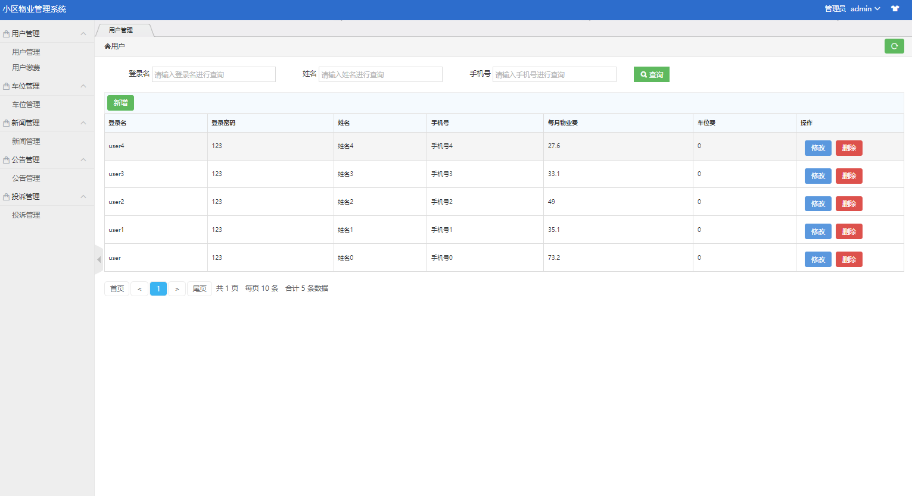
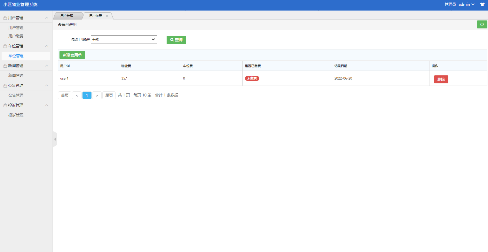
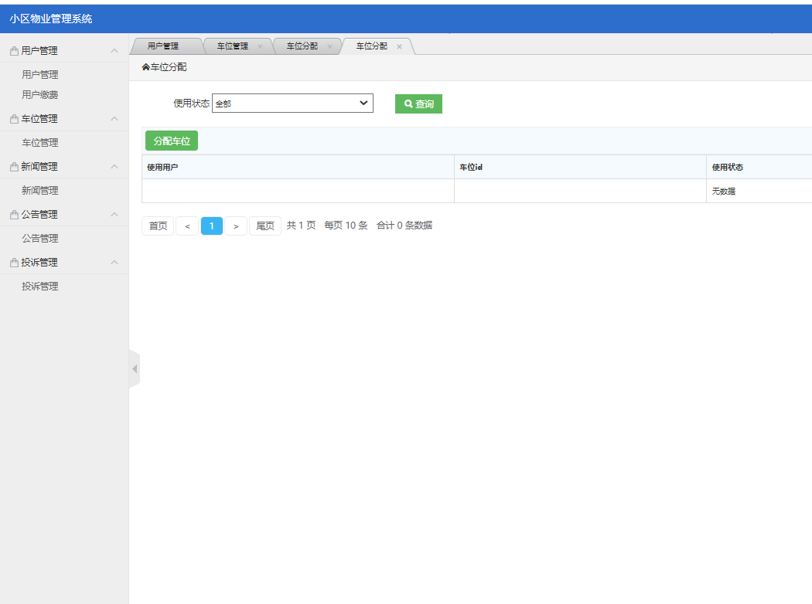
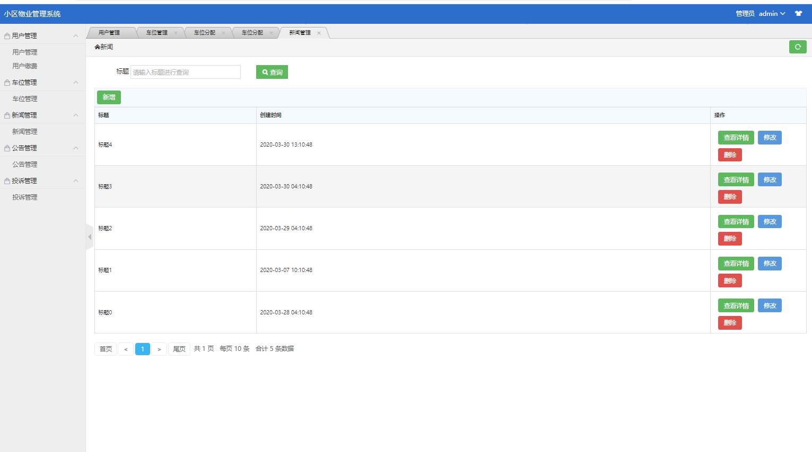
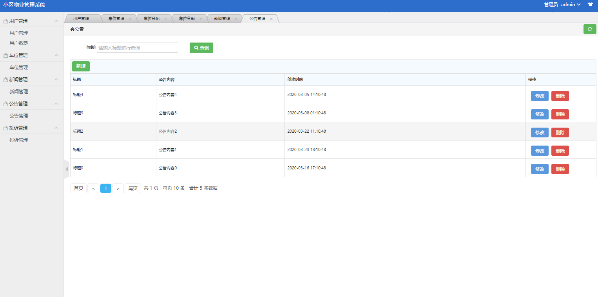
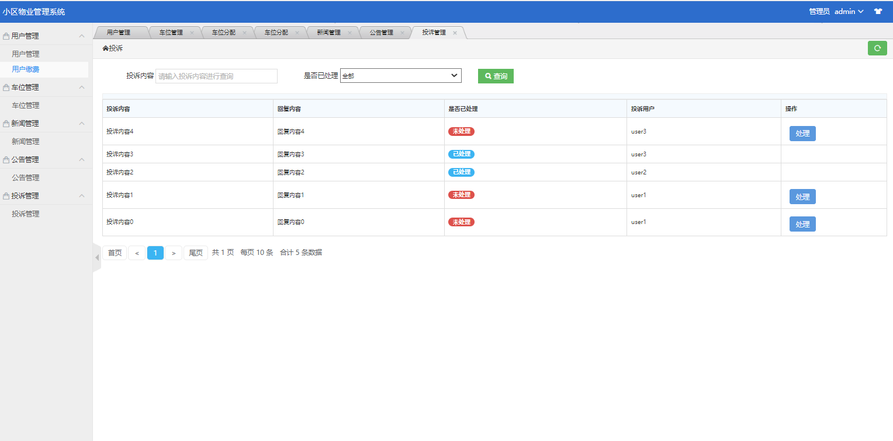
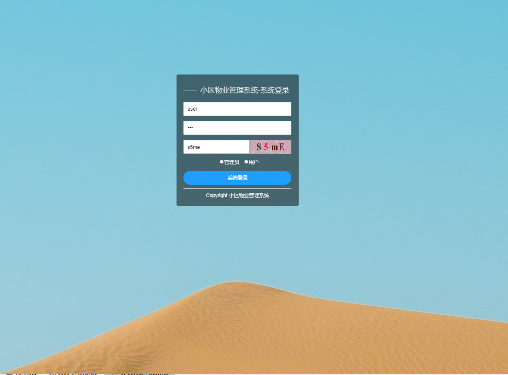
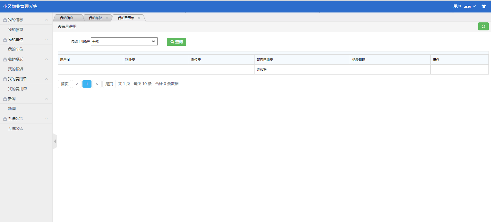
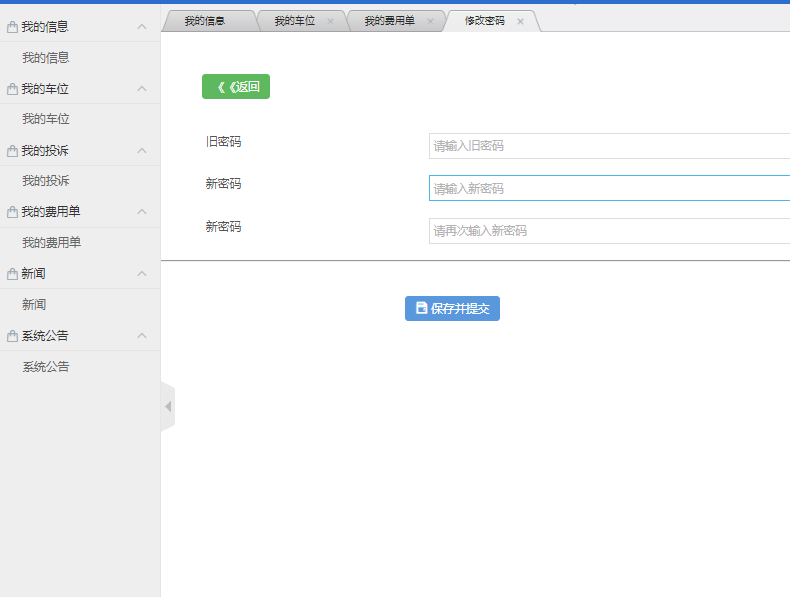

**需要完整代码可以加qq  931708230 或者加微信  ynwwxid**

**需要完整代码可以加qq  931708230 或者加微信  ynwwxid**

#程序员 #java #毕业设计 #小区物业管理系统 #ssm #课程设计 #编程 #jsp #mybatis #源代码

基于ssm的小区物业管理系统
所用技术：ssm+mybatis+mysql+jsp

普通用户

我的信息、我的投诉、我的费用单、新闻查询、公告查询

管理员

用户管理、用户缴费、车位管理、新闻管理、公告管理、投诉管理。

运行地址
http://localhost:8686/estate_master/commonapi/sys_login

管理员 用户名：admin 密码：123

普通用户 用户名：user 密码：123

运行截图

### 基础环境 :IDEA，maven3.6，JDK 1.8， Mysql 5.7, tomcat8.x

### 源码+数据库脚本 

所有项目以及源代码本人均调试运行无问题 可支持远程调试运行

**需要完整代码可以加qq  931708230 或者加微信  ynwwxid**

**需要完整代码可以加qq  931708230 或者加微信  ynwwxid**